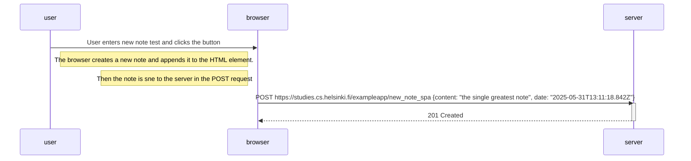

```mermaid
sequenceDiagram
participant user
participant browser
participant server
    user->>browser: User enters new note test and clicks the button
    Note left of browser: The browser creates a new note and appends it to the HTML element.
    Note left of browser: Then the note is sne to the server in the POST request
    browser->>server: POST https://studies.cs.helsinki.fi/exampleapp/new_note_spa {content: "the single greatest note", date: "2025-05-31T13:11:18.842Z"}
    activate server
    server-->>browser: 201 Created
    deactivate server
```
